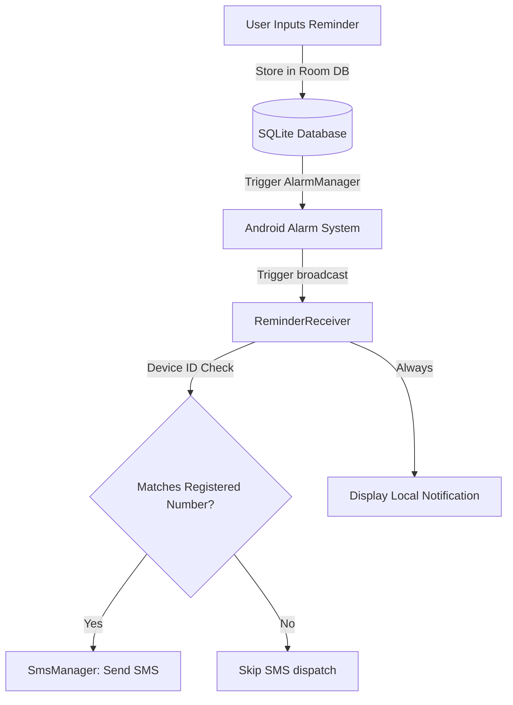

# BackNote 🕰️

**RemindMe** is a premium, offline-first Android application designed for scheduling reminders, sending local alerts, and automating SMS notifications with an emphasis on privacy, security, and clean modern aesthetics.

---

## 🚀 Key Features

*   **Offline-First Architecture**: Your reminders, profile, and attachments remain entirely on your device. No cloud sync, no tracking, and complete user ownership of data.
*   **Smart Scheduling & Dispatch**: Uses Android's `AlarmManager` to schedule and dispatch highly precise reminders that stay active even after device reboots.
*   **Security Lock & Obscuring**: Set a 4-digit PIN to lock sensitive reminders. Locked cards are programmatically masked (`••••`) and visually blurred using Jetpack Compose rendering modifiers.
*   **Export Chats with Image Attachments**: Compile active and archived reminders into a plain text report and share them directly to a configured Gmail address. Any accompanying images are securely attached using standard `ClipData` URI sharing mechanisms.
*   **Device ID Lock verification**: Restricts SMS dispatching. Reminders targeting SMS dispatch will only send text messages if the recipient matches the phone number linked to the local device ANDROID_ID, preventing unauthorized automated sending.
*   **Legal Policies & Customization**: Complete app policy integration (About Us, Privacy Policy, Terms & Conditions) with support for customizable font sizes and adaptive light/dark themes.

---

## 🛠️ Technology Stack

*   **UI Framework**: Jetpack Compose (Modern Declarative UI)
*   **Database**: Room Persistence Library (SQLite abstraction)
*   **Concurrency**: Kotlin Coroutines & Flow (Reactive programming)
*   **Navigation**: Jetpack Navigation Compose
*   **System Services**: `AlarmManager` for precise scheduling, `SmsManager` for automated dispatches, and `BroadcastReceiver` for event listening.

---

## 📊 System Architecture & Flow



---

## 🔒 Security & Privacy Boundaries

### 1. PIN Lock & Obscuring
When a reminder is locked behind the 4-digit passcode:
*   The title and message are replaced with `•` characters.
*   The entire card container is blurred using a `16.dp` Compose blur filter.
*   Any attached media previews (images and voice notes) are completely hidden from the UI.
*   Locked reminders' images are excluded from chat exports.

### 2. Device ID Binding
On first launch, the application registers the local device's unique identifier (`Settings.Secure.ANDROID_ID`) in the local database. When the user sets up their profile phone number, it binds to this device ID. During alarm triggers, SMS dispatches are locked unless the target number matches the bound profile number.

---

## 📥 Local Setup & Installation

### Prerequisites
*   Android Studio Ladybug (or higher)
*   JDK 17
*   Android SDK 34 (API level 34)

### Getting Started
1. Clone the repository:
   ```bash
   git clone https://github.com/Aryan005-coder/RemindMe.git
   cd RemindMe
   ```
2. Open the project in Android Studio.
3. Sync project with Gradle files.
4. Run the application on your emulator or connected device:
   *   Select the `app` configuration.
   *   Click the **Run** button.

---

## 📄 License & Policies

This application is built for personal productivity and offline automation. Please check out the **Privacy Policy** and **Terms of Service** directly in the app's settings section for full details on offline data boundaries.
